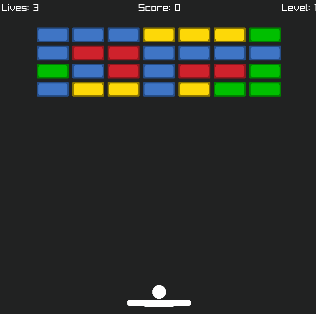
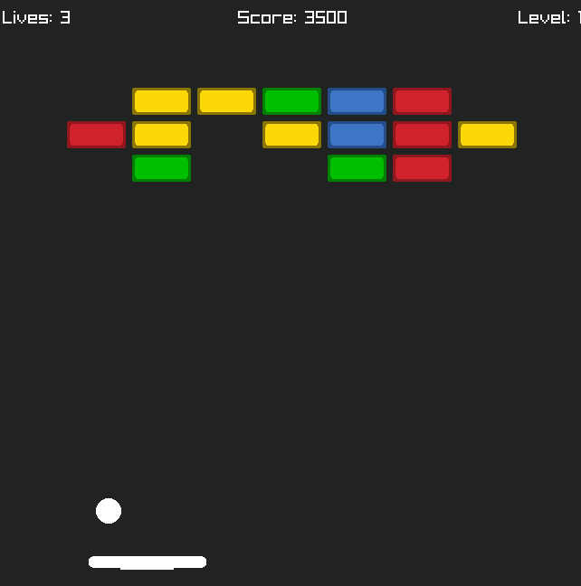

# Breakout Game
# Made from late July to early August (5-7 days)

My attempt to make a breakout game similar to Google's breakout game.

// Features //

- The paddle, ball, and bricks are all textured and colored by me in Piskel
- SFX were found in audio libraries such as Kenney
- Score and Life systems
- Endless levels with increasing difficulty
- Decent brick collision detection
- You can play the game over and over

// Controls //

- Left Arrow = Move Left
- Right Arrow = Move Right
- Up = Launch ball from paddle
- Enter = restart after game ends

// Things used //

- Language: C++
- Raylib Programming Library

// Images of the game //

// How to Run //

Make a copy of the repository, then build the project and run the executable.

// Future Improvements (the date as of writing this is August 4th, 2026) //

- Adding animations and particles once I get better at making textures
- Making each brick have special effects, similar to the Google game
- Save the best high score the player gets
- Adding powerups which help the player (TNT, Aim-Lock, etc.)